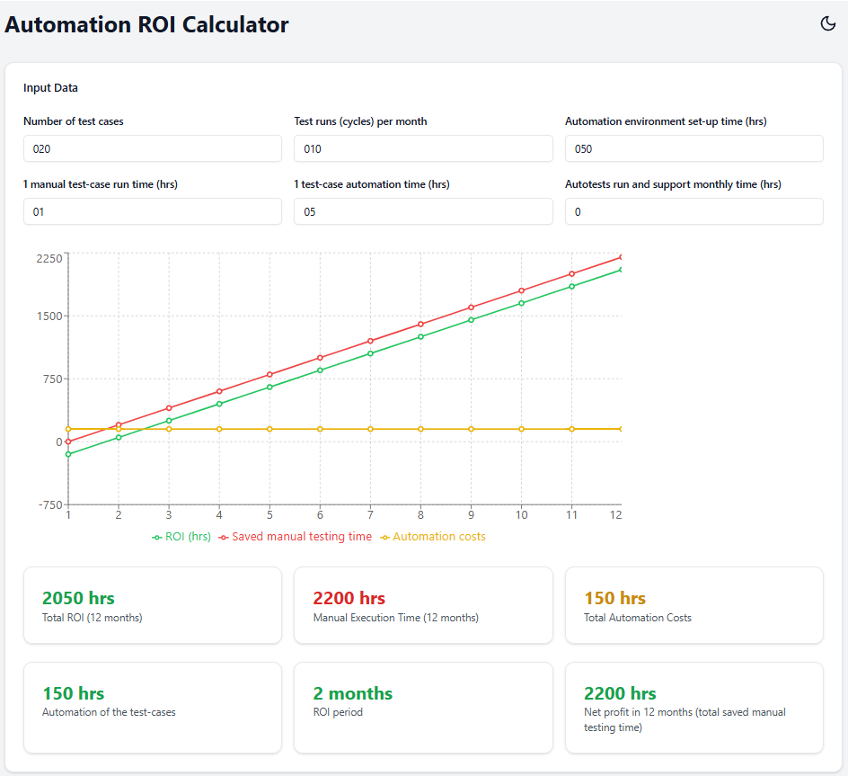

# Test Automation ROI Calculator
=====================================

## Overview
------------

This web app calculates the Return on Investment (ROI) of automating manual test cases. It provides a simple and intuitive way to input parameters and visualize the benefits of test automation.

## Features
------------

* Calculate Net Benefits and ROI Period based on input parameters
* Visualize the results with a graph
* Input parameters:
	+ Number of test cases to automate
	+ Time to automate each test case
	+ Time to manually execute each test case
	+ Automated tests maintenance time
	+ Test environment setup time

## Screenshot
-------------

## Live App
------------

Try out the live app here: [https://valiantsin2021.github.io/test-automation-roi-calculator](https://valiantsin2021.github.io/test-automation-roi-calculator)

## How it Works
----------------

1. Enter the number of test cases to automate
2. Input the time to automate each test case
3. Input the time to manually execute each test case
4. Input the automated tests maintenance time
5. Input the test environment setup time
6. The results will be displayed instantly

## Example Use Case
--------------------

Suppose you have 100 manual test cases that take 10 minutes each to execute. You estimate it will take 5 minutes to automate each test case, and 1 hour to set up the test environment. You also expect to spend 2 hours per month maintaining the automated tests.

 Input these values into the calculator:

* Number of test cases to automate: 100
* Time to automate each test case: 5 minutes
* Time to manually execute each test case: 10 minutes
* Automated tests maintenance time: 2 hours/month
* Test environment setup time: 1 hour

## Technical Details
--------------------

This web app is built using [React](https://reactjs.org/) . The calculation logic is implemented in JavaScript.

## License
-------

This project is licensed under the MIT License. See [LICENSE](LICENSE) for details.

## Contributing
------------

Contributions are welcome! Please submit a pull request with your changes.